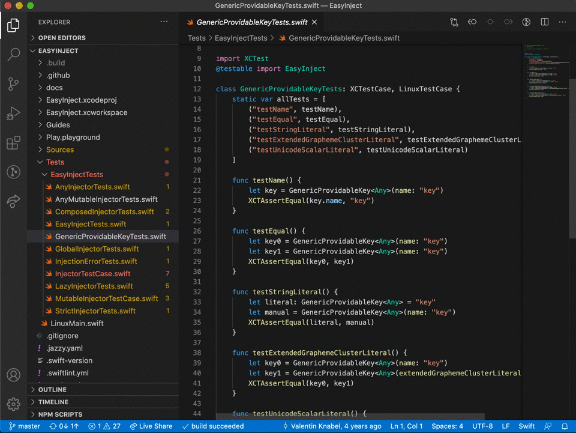

# vscode-swifttasks

An extension to help you run tasks such as `swift test` from within VSCode. Simply install it from the [Visual Studio Marketplace](https://marketplace.visualstudio.com/items?itemName=aussiegeek.swifttasks) to get started.

## Usage

Open the command palette of VS Code, select `Task: Run Tasks`, then `swift` and finally the build or test task of your choice.

> The actual tasks might differ as swifttasks automatically scans for your all your targets.
> The general naming scheme is `swift: <build|test> ModuleOrPackageName`
